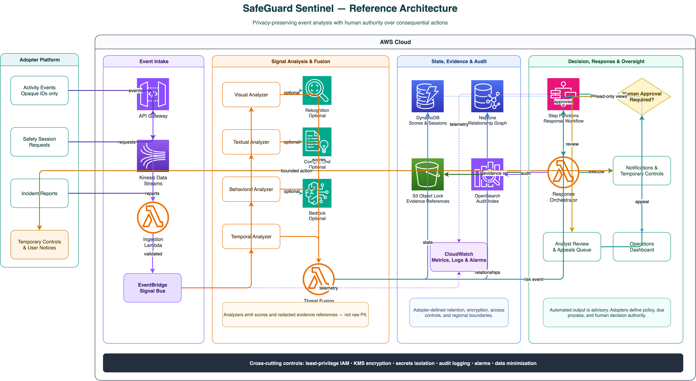

# SafeGuard Sentinel

SafeGuard Sentinel is a customer-neutral, open reference implementation for
privacy-preserving trust and safety workflows on AWS. It demonstrates how to
correlate visual, textual, behavioral, and temporal risk signals; preserve
evidence references; coordinate proportionate responses; and keep humans in
control of consequential actions.

> **Public beta:** this repository is a reference implementation, not a
> production deployment, safety certification, or substitute for legal,
> privacy, security, and policy review. The bundled dashboard uses synthetic
> fixtures only. See [BETA.md](BETA.md) for the explicit adoption gates.



## What is included

- TypeScript domain models and independently testable Lambda handler logic
- Four signal-analysis domains and a threat-fusion engine
- Graduated safety prompts, temporary controls, evidence, appeals, and audit
  workflows
- A React operations dashboard backed by clearly marked synthetic fixtures
- Editable Draw.io architecture source plus SVG and PNG exports
- Automated checks that reject known source-brand terms, email addresses,
  precise coordinates, and non-documentation IPv4 addresses

The repository intentionally uses dependency-injected service interfaces. It
does **not** yet include deployable CDK, SAM, or CloudFormation infrastructure.
The architecture diagram describes the intended AWS deployment boundary.

## Reference architecture

- **Intake:** Amazon API Gateway, Amazon Kinesis Data Streams, AWS Lambda, and
  Amazon EventBridge
- **Analysis:** AWS Lambda with optional Amazon Rekognition, Amazon Comprehend,
  and Amazon Bedrock adapters
- **State and evidence:** Amazon DynamoDB, Amazon Neptune, Amazon S3 Object
  Lock, and Amazon OpenSearch Service
- **Response and oversight:** AWS Step Functions, Lambda, an analyst review
  queue, appeals, and an operations dashboard
- **Operations:** Amazon CloudWatch, least-privilege IAM, encryption, audit
  logging, retention controls, and data minimization

Low-impact prompts and temporary friction are represented as automated
examples. Level 3 and Level 4 handlers fail closed: they preserve evidence and
queue a review, but do not execute unless an injected approval service verifies
an opaque decision reference bound to the proposed action. Adopters must still
implement the independent authorization system and their own due-process
policy.

## Privacy boundary

The public project contains no production records, personal contact details,
precise locations, inherited Git history, or production-derived metrics.
Identifiers in fixtures are explicit `DEMO-*` tokens, message content is
redacted, and locations and contacts are represented by opaque references.

Run the privacy guard before every commit:

```bash
npm run privacy:check
```

See [PRIVACY.md](PRIVACY.md) for the contribution and runtime data rules.

## Getting started

### Prerequisites

- Node.js 24.20.0
- npm 11 or later

### Install and verify

```bash
npm ci --ignore-scripts --no-audit
npm run verify
```

### Run the dashboard

```bash
npm run dev --workspace @safeguard-sentinel/dashboard
```

The local dashboard is served at `http://localhost:3000`.

### Container image

```bash
docker build -t safeguard-sentinel .
docker run --rm -p 8080:8080 safeguard-sentinel
```

## Repository layout

```text
packages/
  shared/       Shared contracts, enums, constants, and validators
  lambdas/      Testable serverless workflow and handler logic
  dashboard/    React operations dashboard and synthetic fixtures
docs/
  architecture/ Editable Draw.io source and rendered architecture assets
scripts/        Release and privacy checks
```

## Security and contributions

Please read [SECURITY.md](SECURITY.md) before reporting a vulnerability and
[CONTRIBUTING.md](CONTRIBUTING.md) before opening a pull request. Project
expectations and boundaries are documented in [CODE_OF_CONDUCT.md](CODE_OF_CONDUCT.md),
[GOVERNANCE.md](GOVERNANCE.md), and [SUPPORT.md](SUPPORT.md).

Maintainers should follow [the release and publication checklist](docs/releasing.md).

## License

Licensed under the [MIT No Attribution License](LICENSE).
